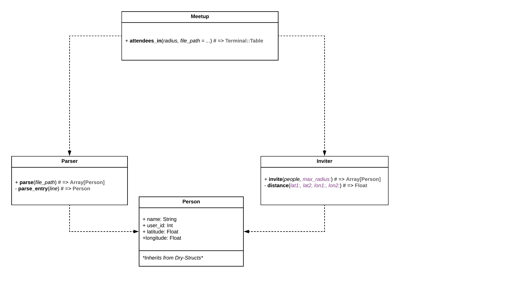

# Meetup


The repository contains my solution one of the problems proposed by [Intercom](https://blog.intercom.com/how-we-hire-engineers-part-1/) as part of their recruitment process.

The instructions say as follows:

> We have some customer records in a text file (customers.json, attached) one customer per line, JSON-encoded. We want to invite any customer within 100km of our Dublin office (GPS coordinates 53.3381985, -6.2592576) to some food and drinks on us.Write a program that will read the full list of customers and output the names and user ids of matching customers (within 100km), sorted by user id (ascending).

## Solution

Here's is a graphic summary of the solution in the form of a UML Class Diagram. It's quite straight-forward: two main classes (Parser and Inviter), a __model_ class (Person) and the entry point for the user (the own namespace of the project).



To get the program running two ways are provided once it's been cloned. The easiest one is to build the image with Docker, which will execute the assignment without any further configuration needed.

```
docker build -t sergio/meetup .
```

However, by using Docker, you can't modify the input for the program without changing the `Dockerfile`. In case you would like to try out the code with a different input, let's say a larger set for further testing or different coordinates as a reference, you can still do it manually following the steps down below:

```
bundle install
COORDINATES="53.339428, -6.257664" rake invite[100] # Radius: 100km
COORDINATES="53.339428, -6.257664" rake invite[100, /Another/Abosolute/Path/To/File]
```

## Notes

I decided to use [dry-structs](https://github.com/dry-rb/dry-struct) to ensure type checks while parsing each line of the source file. It makes the code way more robust as files as input are dangerously error-prone. Also, it provides out of the box Hash coercion, hence the parsing becomes more concise as well by avoid type transformations.
